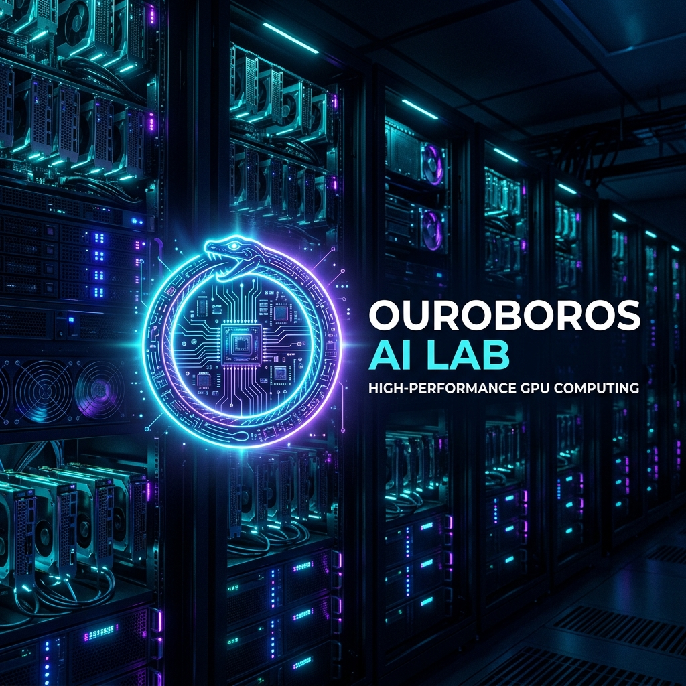
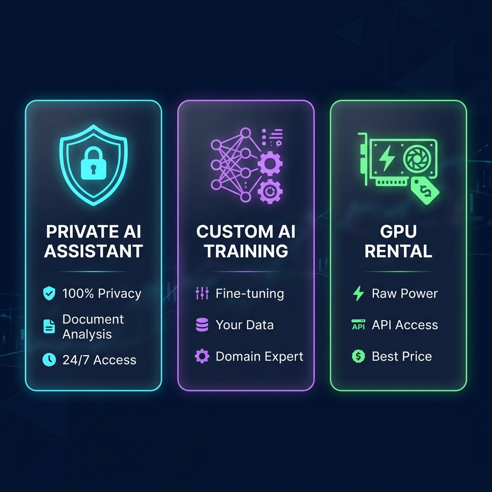
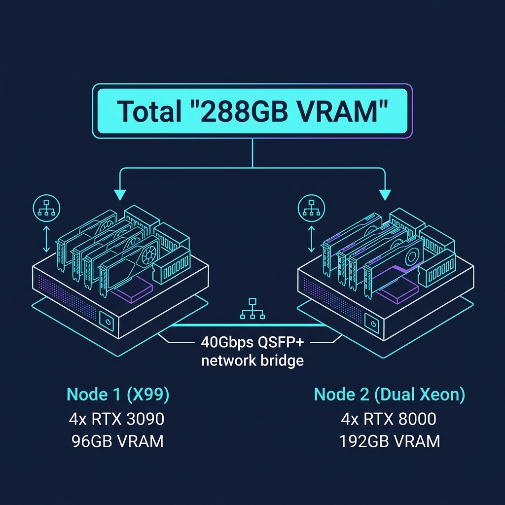
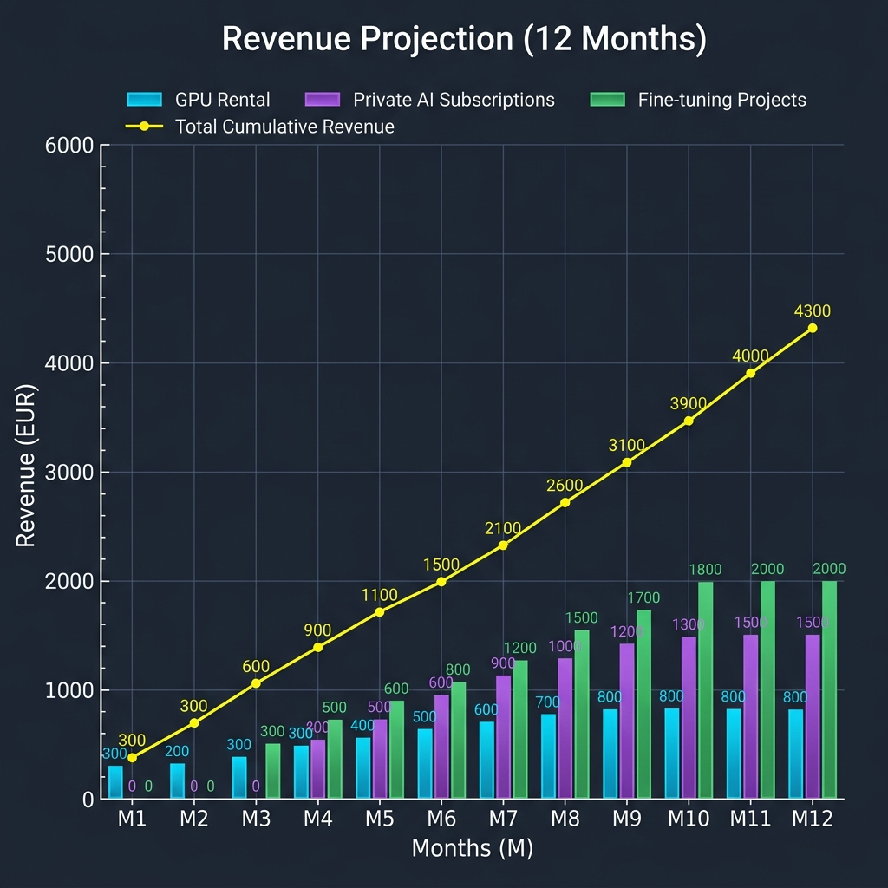
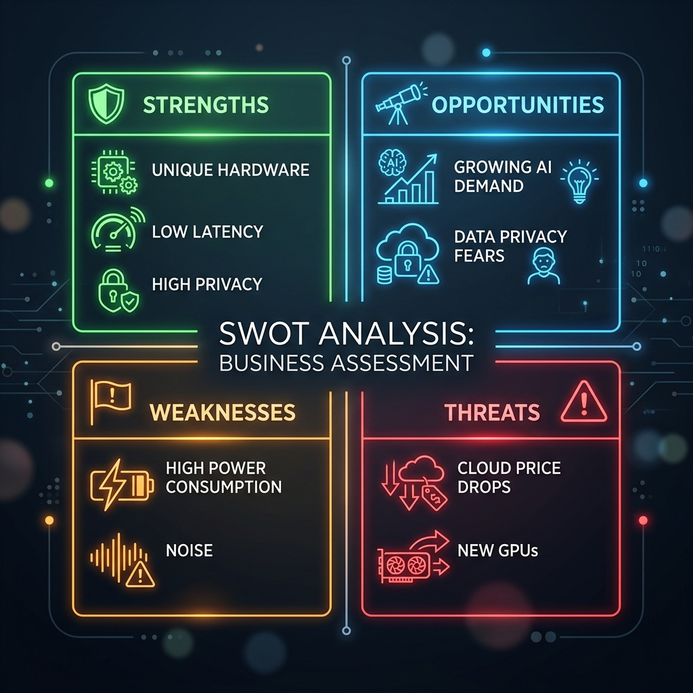

<p align="center">
  
</p>

<h1 align="center">🐍 OUROBOROS AI LAB</h1>

<p align="center">
  <strong>VAŠ PRIVATNI AI SUPERKOMPJUTER – LOKALNO. SIGURNO. MOĆNO.</strong>
</p>

<p align="center">
  
  
  
  
</p>

<p align="center">
  <em>Zaboravite na skupi i nesigurni Cloud. Iskoristite snagu od preko 288GB VRAM-a direktno u Novom Pazaru.</em>
</p>

---

## 📋 Sadržaj

- [Rezime](#-rezime)
- [Usluge i Proizvodi](#-usluge-i-proizvodi)
- [Tehnička Infrastruktura](#-tehnička-infrastruktura)
- [Cloud vs. Ouroboros – Poređenje](#-cloud-vs-ouroboros--poređenje)
- [Marketing Strategija](#-marketing-strategija)
- [Finansijski Plan](#-finansijski-plan)
- [Operativni Plan](#-operativni-plan--roadmap-6-meseci)
- [SWOT Analiza](#-swot-analiza)
- [Primeri Upotrebe](#-primeri-upotrebe)
- [Kontakt](#-kontakt)

---

## 🎯 Rezime

**Ouroboros AI Lab** je inovativni provajder AI infrastrukture sa sedištem u **Novom Pazaru, Srbija**. Koristeći napredni GPU klaster sa ukupno **288GB VRAM-a**, nudimo usluge koje su inače rezervisane za velike cloud korporacije (AWS, Azure, Google Cloud), ali uz:

| Prednost | Opis |
|:---:|:---|
| 🔒 **100% Privatnost** | Vaši podaci nikada ne napuštaju naš lokalni server |
| 💰 **Niži troškovi** | Do 5x jeftinije od cloud alternativa |
| ⚡ **Ultra-niska latencija** | <5ms lokalni pristup vs. 50-200ms cloud |
| 🤝 **Lokalna podrška** | Direktan kontakt i podrška na srpskom jeziku |
| 🔧 **Prilagodljivost** | Rešenja krojimo po meri vašeg biznisa |

> 💡 **Misija:** Demokratizacija pristupa AI tehnologiji za firme na Balkanu — bez kompromisa u privatnosti i bez astronomskih troškova.

---

## 🚀 Usluge i Proizvodi

<p align="center">
  
</p>

### 🛡️ A. Managed Private AI (SaaS)

> **Vaš privatni ChatGPT — ali potpuno bezbedan.**

Instalacija i održavanje privatnih instanci AI asistenata za firme. Zamislite ChatGPT, ali jedan koji radi **isključivo na vašim podacima** i nikada ih ne šalje na internet.

**Šta dobijate:**
- 🤖 Privatnu AI instancu hostovanu lokalno u našem labu
- 📄 Analizu hiljada dokumenata u sekundi (ugovori, pravilnici, medicinska dokumentacija)
- 🔐 Zero-knowledge arhitekturu — ni mi nemamo pristup vašim podacima tokom obrade
- 🔄 Automatske nadogradnje modela bez prekida rada
- 📊 Admin dashboard za praćenje korišćenja

**Ciljna grupa:**

| Industrija | Primer upotrebe |
|:---|:---|
| ⚖️ Advokatske kancelarije | Analiza ugovora, pretraživanje sudske prakse, generisanje pravnih dokumenata |
| 📊 Knjigovodstvene agencije | Automatska kategorizacija faktura, poreske konsultacije, izrada izveštaja |
| 🏥 Medicinske klinike | Analiza nalaza, asistencija u dijagnostici, upravljanje dokumentacijom |
| 🏦 Finansijske kompanije | Risk analiza, compliance provera, automatska obrada zahteva |
| 🏭 Proizvodni pogoni | Kontrola kvaliteta pomoću AI, optimizacija nabavki |

**Model pretplate:**
```
┌─────────────────────────────────────────────────────────┐
│  📦 STARTER      │  🏢 BUSINESS      │  🏗️ ENTERPRISE  │
│  100 €/mes       │  200 €/mes        │  300+ €/mes     │
│                   │                    │                  │
│  • 1 AI model     │  • 3 AI modela    │  • Neograničeno  │
│  • 5 korisnika    │  • 20 korisnika   │  • Custom setup  │
│  • Email podrška  │  • Prioritet      │  • 24/7 podrška  │
│  • 50GB storage   │  • 200GB storage  │  • 1TB+ storage  │
└─────────────────────────────────────────────────────────┘
```

---

### 🧠 B. Custom AI Training (Fine-tuning)

> **AI koji poznaje vaš biznis bolje od bilo kog zaposlenog.**

Prilagođavanje AI modela specifičnim potrebama klijenta. Treniramo modele na vašim internim podacima tako da AI postaje ekspert za vaš domen.

**Proces fine-tuninga:**

```
┌──────────┐    ┌──────────────┐    ┌──────────────┐    ┌──────────────┐
│ 1. PODACI │──▶│ 2. PRIPREMA  │──▶│ 3. TRENING   │──▶│ 4. DEPLOY    │
│           │    │              │    │              │    │              │
│ Klijent   │    │ Čišćenje,    │    │ Fine-tuning  │    │ Produkcija   │
│ dostavi   │    │ formatiranje │    │ na našem GPU │    │ na vašem     │
│ podatke   │    │ i validacija │    │ klasteru     │    │ serveru      │
└──────────┘    └──────────────┘    └──────────────┘    └──────────────┘
```

**Konkretni primeri:**

| Projekat | Opis | Rezultat |
|:---|:---|:---|
| 🇷🇸 Pravni AI za Srbiju | Model obučen na svim zakonima i propisima RS | AI koji citira tačne članove zakona |
| 📋 Interni pravilnik AI | Model treniran na internim procedurama firme | Zaposleni dobijaju instant odgovore |
| 🏥 Medicinski AI | Obučen na stručnoj medicinskoj literaturi | Asistencija lekarima u dijagnostici |
| 🛒 E-commerce AI | Treniran na istoriji narudžbina i proizvoda | Personalizovane preporuke kupcima |

**Cene:**
- Mali projekti (do 10.000 dokumenata): **od 500 €**
- Srednji projekti (10.000-100.000 dokumenta): **od 1.500 €**
- Veliki projekti (100.000+ dokumenata): **po dogovoru**

---

### 💻 C. GPU Infrastructure as a Service (IaaS)

> **Brutalan hardver na dohvat ruke — bez kupovine sopstvene opreme.**

Iznajmljivanje sirove GPU snage putem platformi ili direktno kroz naš **Ouroboros Bridge** API.

**Šta nudimo:**
- 🎮 **RTX 3090** (24GB VRAM) — Idealno za inference i manje treninge
- 🖥️ **RTX 8000** (48GB VRAM) — Za ozbiljan rad sa velikim modelima
- 🌐 **Ouroboros Bridge API** — Povežite vašu aplikaciju direktno na naš klaster
- 📡 **Vast.ai integracija** — Dostupni i preko globalne marketplace platforme

**Upotreba:**
```
# Primer: Poziv Ouroboros Bridge API-ja
curl -X POST https://bridge.ouroboros-ai.rs/v1/inference \
  -H "Authorization: Bearer YOUR_API_KEY" \
  -H "Content-Type: application/json" \
  -d '{
    "model": "llama-3-70b",
    "prompt": "Analiziraj ovaj ugovor...",
    "max_tokens": 2048,
    "temperature": 0.7
  }'
```

**Poređenje cena GPU iznajmljivanja:**

| Provajder | GPU | Cena/sat | Cena/mesec (24/7) |
|:---|:---|:---:|:---:|
| AWS (p4d) | A100 80GB | ~3.50 € | ~2,520 € |
| Google Cloud | A100 40GB | ~2.80 € | ~2,016 € |
| RunPod | RTX 3090 | ~0.40 € | ~288 € |
| **Ouroboros AI Lab** | **RTX 3090** | **~0.25 €** | **~180 €** |
| **Ouroboros AI Lab** | **RTX 8000** | **~0.35 €** | **~252 €** |

---

## 🏗️ Tehnička Infrastruktura

<p align="center">
  
</p>

### Hardverska Specifikacija

```
╔══════════════════════════════════════════════════════════════════════════╗
║                    OUROBOROS AI LAB – GPU KLASTER                       ║
║                        Ukupno: 288GB VRAM                              ║
╠══════════════════════════════════════════════════════════════════════════╣
║                                                                        ║
║  ┌─────────────────────────────┐    ┌─────────────────────────────┐    ║
║  │   🖥️  NODE 1 (X99)          │    │   🖥️  NODE 2 (Dual Xeon)    │    ║
║  │                             │    │                             │    ║
║  │   GPU: 4x NVIDIA RTX 3090  │    │   GPU: 4x NVIDIA RTX 8000  │    ║
║  │   VRAM: 96 GB (4x24GB)     │◄──►│   VRAM: 192 GB (4x48GB)    │    ║
║  │   Namena: Brzi inference    │    │   Namena: Training +        │    ║
║  │   (odgovori u realnom       │    │   rad sa ogromnim           │    ║
║  │    vremenu)                 │    │   modelima                  │    ║
║  │                             │    │                             │    ║
║  │   CPU: Intel X99 chipset    │    │   CPU: 2x Intel Xeon       │    ║
║  │   RAM: 64GB DDR4           │    │   RAM: 128GB+ DDR4 ECC     │    ║
║  │   Storage: 2TB NVMe SSD    │    │   Storage: 4TB NVMe SSD    │    ║
║  └─────────────────────────────┘    └─────────────────────────────┘    ║
║                          │                      │                      ║
║                          └──────────┬───────────┘                      ║
║                                     │                                  ║
║                      ┌──────────────┴──────────────┐                   ║
║                      │   🌐 MREŽA                   │                   ║
║                      │   40Gbps QSFP+ Mellanox      │                   ║
║                      │   Ultrabrza interna           │                   ║
║                      │   komunikacija               │                   ║
║                      └──────────────────────────────┘                   ║
║                                                                        ║
║  Software Stack:                                                       ║
║  • Proxmox VE (virtualizacija)  • Docker + Kubernetes                  ║
║  • NVIDIA CUDA 12.x             • PyTorch / TensorFlow                 ║
║  • Ollama / vLLM / TGI          • Ouroboros Bridge (custom API)        ║
╚══════════════════════════════════════════════════════════════════════════╝
```

### GPU Performance Benchmarks

| Metrika | RTX 3090 (x4) | RTX 8000 (x4) |
|:---|:---:|:---:|
| FP32 Performance | 142.6 TFLOPS | 64.4 TFLOPS |
| FP16 (Tensor Core) | 284 TFLOPS | 128.8 TFLOPS |
| VRAM Bandwidth | 3,744 GB/s | 2,240 GB/s |
| Podržani modeli | Do 70B parametara | Do 180B+ parametara |
| Inference brzina (Llama 3 8B) | ~120 tok/s | ~85 tok/s |
| Inference brzina (Llama 3 70B) | ~25 tok/s | ~18 tok/s |
| Max batch size (8B model) | 32 concurrent | 64 concurrent |

### Mreža i Konektivnost

```
Internet (Optička veza)
        │
        ▼
┌───────────────┐
│   Firewall    │──── Zaštita od neovlašćenog pristupa
│   (pfSense)   │
└───────┬───────┘
        │
        ▼
┌───────────────┐
│   Router /    │──── VLAN segmentacija, QoS
│   Switch      │
└───────┬───────┘
        │
   ┌────┴────┐
   │         │
   ▼         ▼
Node 1    Node 2 ◄─── 40Gbps QSFP+ (Mellanox ConnectX-3)
```

---

## ⚡ Cloud vs. Ouroboros – Poređenje

| Kriterijum | ☁️ Cloud (AWS/Azure/GCP) | 🐍 Ouroboros AI Lab |
|:---|:---:|:---:|
| **Privatnost podataka** | ⚠️ Podaci idu na tuđe servere | ✅ 100% lokalno – nikad na internet |
| **Latencija** | 50-200ms | <5ms |
| **Mesečni trošak (1x GPU)** | 500-2,500 € | 100-300 € |
| **Lock-in** | ⚠️ Zavisnost od provajdera | ✅ Bez vezivanja |
| **Prilagodljivost** | Ograničena | ✅ Potpuno prilagodljivo |
| **Jezik podrške** | Engleski | ✅ Srpski + Engleski |
| **Lokacija podataka** | USA / EU / nepoznato | ✅ Novi Pazar, Srbija |
| **SLA / Uptime** | 99.9% | 99.5% |
| **Skalabilnost** | ✅ Skoro neograničena | ⚠️ Ograničena kapacitetom |

---

## 📣 Marketing Strategija

### 🏢 Lokalni Marketing (Novi Pazar i Regija)

| Kanal | Aktivnost | Cilj |
|:---|:---|:---|
| 🤝 Direktna prodaja | Lični sastanci sa vlasnicima firmi | Konverzija 2-3 klijenta mesečno |
| 📚 Radionice | Besplatne radionice "AI u službi biznisa" | Edukacija tržišta, 20+ učesnika |
| 🏛️ Privredna komora | Prezentacije na događajima komore | Kredibilitet i mrežanje |
| 📰 Lokalni mediji | PR članci o AI inovaciji iz Novog Pazara | Brand awareness |

### 🌐 Digitalni Marketing

| Kanal | Aktivnost | Cilj |
|:---|:---|:---|
| 💻 GitHub ([vahidzekic](https://github.com/vahidzekic)) | Redovno ažuriranje Ouroboros projekta | Tehnički dokaz stručnosti |
| 💼 LinkedIn | Stručni postovi o AI i privatnosti | B2B lead generacija |
| 📸 Instagram/TikTok | Kratki klipovi: Cloud vs. Lokalni Rig speed test | Viralnost i awareness |
| ✍️ Blog / Medium | Članci: "Zašto vaša firma treba privatni AI" | SEO i organički saobraćaj |
| 📧 Email kampanje | Newsletter sa AI novostima i case studies | Nurturing potencijalnih klijenata |

### Content Marketing Primer:
```
📹 Video ideja: "Cloud vs. Ouroboros AI Lab – Speed Test"
─────────────────────────────────────────────────────
Scenario:
1. Isti prompt šaljemo na ChatGPT API i na naš lokalni rig
2. Split-screen prikaz: Ouroboros odgovara za 0.3s, Cloud za 2.1s
3. Bonus: Pokazujemo mrežni saobraćaj – kod nas = 0 paketa van mreže
4. Caption: "Vaši podaci, vaša brzina, vaša kontrola."
```

---

## 💰 Finansijski Plan

<p align="center">
  
</p>

### Inicijalni Troškovi

| Stavka | Procena troška | Status |
|:---|:---:|:---:|
| Matične ploče, procesori, RAM | ~1,000 € | ✅ Postepeno |
| Napajanja (2x 1600W+) | ~500 € | ✅ Postepeno |
| RTX 3090 (4 komada) | ~2,000-3,000 € | 🔄 U toku |
| RTX 8000 (4 komada) | ~3,000-5,000 € | 📋 Planirano |
| Mellanox 40Gbps kartice | ~200 € | 📋 Planirano |
| Rack + hlađenje + kablovi | ~500 € | 📋 Planirano |
| **UKUPNO (procena)** | **~7,200-10,200 €** | |

### Operativni Mesečni Troškovi

| Stavka | Mesečno |
|:---|:---:|
| ⚡ Struja (2-3 kW @ pune opterećenje) | ~100-200 € |
| 🌐 Internet (optika, stabilan upload) | ~30-50 € |
| 🔧 Održavanje i zamena delova | ~50 € |
| **UKUPNO** | **~180-300 €** |

### Projekcija Prihoda (Mesečno)

| Izvor prihoda | Mesec 1-3 | Mesec 4-6 | Mesec 7-12 |
|:---|:---:|:---:|:---:|
| 🖥️ GPU Iznajmljivanje (Vast.ai) | 300-500 € | 400-600 € | 500-800 € |
| 🛡️ Privatni AI za firme | 0 € | 200-600 € | 600-1,500 € |
| 🧠 Fine-tuning projekti | 0 € | 500 € | 1,000-2,000 € |
| **UKUPNO** | **300-500 €** | **1,100-1,700 €** | **2,100-4,300 €** |

### Break-Even Analiza

```
Mesečni troškovi:  ~250 € (prosek)
Break-even tačka:  Mesec 2-3 (samo GPU rental)
Puna profitabilnost: Mesec 5-6 (sa klijentima)

ROI Projekcija (12 meseci):
━━━━━━━━━━━━━━━━━━━━━━━━━━━━━━━━━━━━━━━━━
Ukupna investicija:     ~9,000 €
Ukupni prihod (12m):    ~22,000-30,000 €
Ukupni troškovi (12m):  ~3,000-3,600 €
━━━━━━━━━━━━━━━━━━━━━━━━━━━━━━━━━━━━━━━━━
Net profit (12m):       ~9,400-17,400 €
ROI:                    ~104-193%
━━━━━━━━━━━━━━━━━━━━━━━━━━━━━━━━━━━━━━━━━
```

---

## 📅 Operativni Plan — Roadmap (6 meseci)

```
 MESEC 1-2                MESEC 3-4               MESEC 5                 MESEC 6
 ═══════════             ═══════════             ═══════════             ═══════════
 🔧 HARDVER              🌐 KLASTER              💻 PORTAL               🚀 LANSIRANJE
 ───────────             ───────────             ───────────             ───────────
 • Sklapanje X99         • Nabavka Dual          • Razvoj Ouroboros      • Aktivna prodaja
   riga                    Xeon komponenti         Bridge portala          u Novom Pazaru
 • Instalacija           • 40Gbps QSFP+          • Demo okruženje        • Prva radionica
   Proxmox VE              Mellanox setup           za klijente            "AI u biznisu"
 • Testiranje            • Klaster               • API dokumentacija     • Onboarding
   4x RTX 3090             konfiguracija          • Landing page           prvih klijenata
 • Stress test           • Multi-node             • Testiranje sa        • PR i
   stabilnosti             inference setup          beta korisnicima       medijski nastupi
 • Vast.ai listing       • Backup strategija     • Pricing finalizacija  • Feedback loop
```

### Detaljni Milestone Pregled

| Mesec | Ključne Aktivnosti | Deliverable | KPI |
|:---:|:---|:---|:---|
| **1** | Sklapanje X99, Proxmox install, GPU testovi | Funkcionalan Node 1 | 4x 3090 radi stabilno 24/7 |
| **2** | Vast.ai listing, benchmark testovi, stress test | Pasivni prihod počinje | Prvo iznajmljivanje na Vast.ai |
| **3** | Nabavka Dual Xeon delova, 40G mrežnih karti | Komponente na stolu | Sve komponente kupljene |
| **4** | Sklapanje Node 2, klaster konfiguracija | Funkcionalan klaster | Multi-node inference radi |
| **5** | Ouroboros Bridge razvoj, beta testiranje | Demo portal live | 3+ beta korisnika |
| **6** | Marketing, prodaja, prvi klijenti | Puna operativnost | 2+ plaćajuća klijenta |

---

## 📊 SWOT Analiza

<p align="center">
  
</p>

<table>
  <tr>
    <td width="50%" valign="top">
      <h3>✅ Snage (Strengths)</h3>
      <ul>
        <li><strong>Jedinstven hardver u regionu</strong> — 288GB VRAM klaster je nešto što ne postoji u privatnom sektoru na Balkanu</li>
        <li><strong>Niska latencija</strong> — Lokalni pristup eliminišiše mrežna kašnjenja</li>
        <li><strong>Visoka privatnost</strong> — Zero-data-leak arhitektura</li>
        <li><strong>First-mover advantage</strong> — Pionir u lokalnom AI hostingu u regionu</li>
        <li><strong>Tehnička ekspertiza</strong> — Deep knowledge u GPU computing i AI/ML</li>
      </ul>
    </td>
    <td width="50%" valign="top">
      <h3>⚠️ Slabosti (Weaknesses)</h3>
      <ul>
        <li><strong>Visoka potrošnja struje</strong> — 2-3kW na puno opterećenje</li>
        <li><strong>Buka opreme</strong> — Serveri generišu značajnu buku</li>
        <li><strong>Ograničen kapacitet</strong> — Fizički limit broja GPU-ova</li>
        <li><strong>Zavisnost od jednog lokala</strong> — Nema redundancije lokacije</li>
        <li><strong>Solo operacija</strong> — Rizik od jednog operatera</li>
      </ul>
    </td>
  </tr>
  <tr>
    <td width="50%" valign="top">
      <h3>🚀 Šanse (Opportunities)</h3>
      <ul>
        <li><strong>Eksplozivan rast potražnje za AI</strong> — Tržište AI raste 35%+ godišnje</li>
        <li><strong>Strah firmi od Clouda</strong> — GDPR i lokalna regulativa idu u korist privatnosti</li>
        <li><strong>Nepostojanje konkurencije</strong> — Nijedna lokalna firma ne nudi ovu uslugu</li>
        <li><strong>Državni podsticaji</strong> — Mogućnost prijave za IT subvencije</li>
        <li><strong>Regionalna ekspanzija</strong> — Proširenje na celu Srbiju / Balkan</li>
      </ul>
    </td>
    <td width="50%" valign="top">
      <h3>🔴 Pretnje (Threats)</h3>
      <ul>
        <li><strong>Pad cena u Cloudu</strong> — Veliki provajderi mogu dodatno sniziti cene</li>
        <li><strong>Nova generacija GPU-ova</strong> — Efikasnije kartice mogu zastariti trenutni hardver</li>
        <li><strong>Regulativne promene</strong> — Potencijalne nove regulative za AI</li>
        <li><strong>Nestabilnost struje</strong> — Prekidi mogu uticati na SLA</li>
        <li><strong>Kopiranje modela</strong> — Konkurenti mogu replicirati ideju</li>
      </ul>
    </td>
  </tr>
</table>

---

## 💡 Primeri Upotrebe

### Primer 1: Advokatska Kancelarija "Pravnik AI"

```
📋 Scenario:
   Advokatska kancelarija sa 10 advokata i 50.000+ pravnih dokumenata.

🔧 Rešenje:
   • Fine-tuning Llama 3 modela na svim zakonima RS i internim predmetima
   • Privatna AI instanca dostupna svim advokatima 24/7
   • RAG (Retrieval Augmented Generation) za precizne odgovore sa citiranjem

📊 Rezultat:
   • Vreme pretrage pala sa 2h na 30 sekundi
   • AI citira tačne članove zakona sa >95% tačnošću
   • Ušteda: ~40 radnih sati mesečno

💰 Cena: 200 €/mes (Business paket) + 1.500 € jednokratno (fine-tuning)
```

### Primer 2: Proizvodni Pogon "Smart Factory"

```
📋 Scenario:
   Fabrika nameštaja želi AI kontrolu kvaliteta na proizvodnoj liniji.

🔧 Rešenje:
   • Computer vision model obučen na slikama proizvoda
   • Real-time detekcija defekata putem kamera
   • Integracija sa postojećim SCADA sistemom

📊 Rezultat:
   • Detekcija defekata: 98.5% tačnost
   • Smanjenje škarta za 35%
   • ROI: Vraća investiciju za 4 meseca

💰 Cena: 300 €/mes (Enterprise) + 2.000 € setup
```

### Primer 3: E-commerce Kompanija "Smart Preporuke"

```
📋 Scenario:
   Online prodavnica sa 10.000+ proizvoda i 50.000 mesečnih posetilaca.

🔧 Rešenje:
   • AI recommendation engine baziran na istoriji kupovine
   • Chatbot za korisničku podršku (na srpskom jeziku)
   • Automatsko generisanje opisa proizvoda

📊 Rezultat:
   • Konverzija porasla za 23%
   • Prosečna vrednost korpe porasla za 18%
   • Smanjenje tiketa korisničke podrške za 60%

💰 Cena: 200 €/mes + 1.000 € inicijalni setup
```

### Primer 4: Medicinska Klinika "MedAI Asistent"

```
📋 Scenario:
   Privatna klinika sa 15 lekara i ogromnom arhivom nalaza.

🔧 Rešenje:
   • AI obučen na medicinskoj literaturi i internim protokolima klinike
   • Asistencija u dijagnostici — ne zamenjuje lekara, već pomaže
   • Automatska organizacija i pretraga medicinske dokumentacije
   • HIPAA-nivo privatnosti (podaci nikad ne napuštaju kliniku)

📊 Rezultat:
   • Pretraga nalaza brža za 90%
   • Lekari koriste AI za "second opinion" u 70% slučajeva
   • Administrativno vreme smanjeno za 50%

💰 Cena: 300 €/mes (Enterprise) + 2.500 € fine-tuning
```

---

## 🔮 Vizija za Budućnost

```
2025 Q3-Q4    →  Lansiranje Ouroboros AI Lab v1.0
                  Fokus: Novi Pazar + okolni gradovi
                  Target: 5-10 klijenata

2026 Q1-Q2    →  Ekspanzija na širu Srbiju
                  Dodavanje novih GPU nodova
                  Target: 20-30 klijenata

2026 Q3-Q4    →  Regionalna ekspanzija (BiH, CG, Kosovo)
                  Partnerstva sa IT firmama
                  Target: 50+ klijenata

2027+         →  Ouroboros AI Lab kao regionalni lider
                  Data centar sa 1000+ GB VRAM
                  Franchise model za druge gradove
```

---

## 🛠️ Tehnološki Stack

| Kategorija | Tehnologije |
|:---|:---|
| **Virtualizacija** | Proxmox VE, Docker, Kubernetes |
| **AI Frameworki** | PyTorch, TensorFlow, Hugging Face Transformers |
| **Inference Engine** | Ollama, vLLM, Text Generation Inference (TGI) |
| **API Gateway** | Ouroboros Bridge (Node.js / FastAPI) |
| **Monitoring** | Grafana, Prometheus, NVIDIA DCGM |
| **Storage** | ZFS, NVMe SSD RAID, MinIO (S3-compatible) |
| **Networking** | Mellanox ConnectX-3, pfSense, WireGuard VPN |
| **OS** | Proxmox VE (Debian-based), Ubuntu Server 22.04 |

---

## 📞 Kontakt

<p align="center">
  <strong>Vahid Zekic — Osnivač & CEO, Ouroboros AI Lab</strong>
</p>

<p align="center">
  📍 <strong>Novi Pazar, Srbija</strong><br/>
  📞 <strong>+381 66 390 440</strong><br/>
  📧 <strong>vahidzekic@gmail.com</strong><br/>
  🌐 <strong><a href="https://github.com/vahidzekic">github.com/vahidzekic</a></strong>
</p>

<p align="center">
  <a href="mailto:vahidzekic@gmail.com"></a>
  <a href="https://github.com/vahidzekic"></a>
</p>

---

<p align="center">
  <sub>
    <strong>© 2025 Ouroboros AI Lab</strong> — Sva prava zadržana.<br/>
    <em>Lokalno. Sigurno. Moćno.</em> 🐍
  </sub>
</p>
